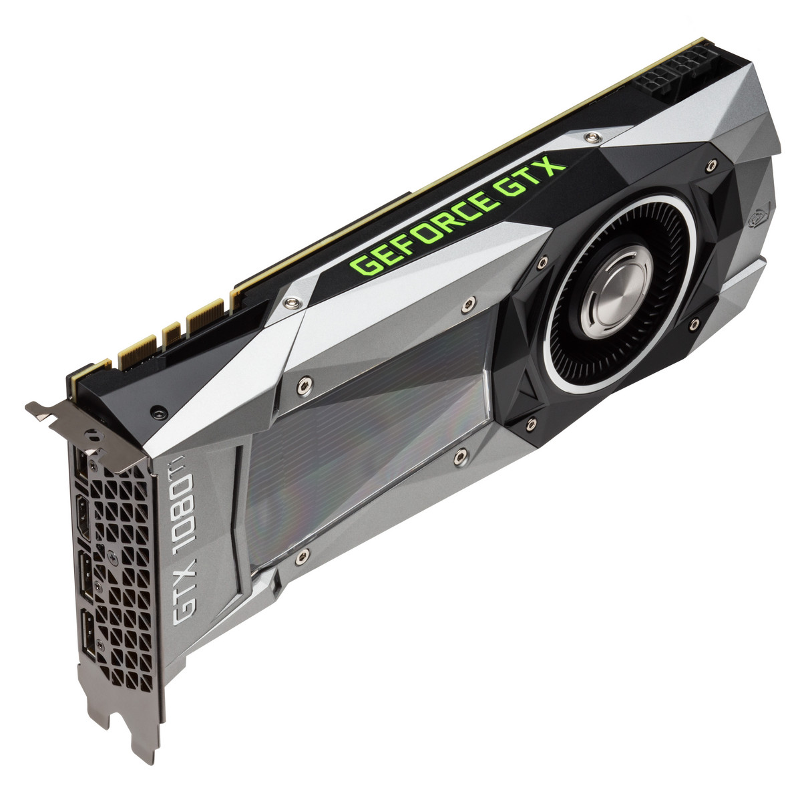

# Image Processing Masks-Convolution

The goal was the Parallel Implementation of Image Histogram achieving best possible speed and the maximum accuracy
- Originally developed 04/11/2017

## Goal of This project  
The reason for the development of this project was to learn better CUDA and understand the different ways of thinking that parallel programming Needs, it was vital to understand the completly reversed way of thinking and the interesting way of development in a parallel language.

Also, it was an experiment for developing an algorithm for Histogram implementation that is faster than the classic atomicAdd. In the end, it was significantly slower but it was an amazing process and learning experience none the less

## Results of the Project 

## Technology Used 
CUDA and MATLAB combination
